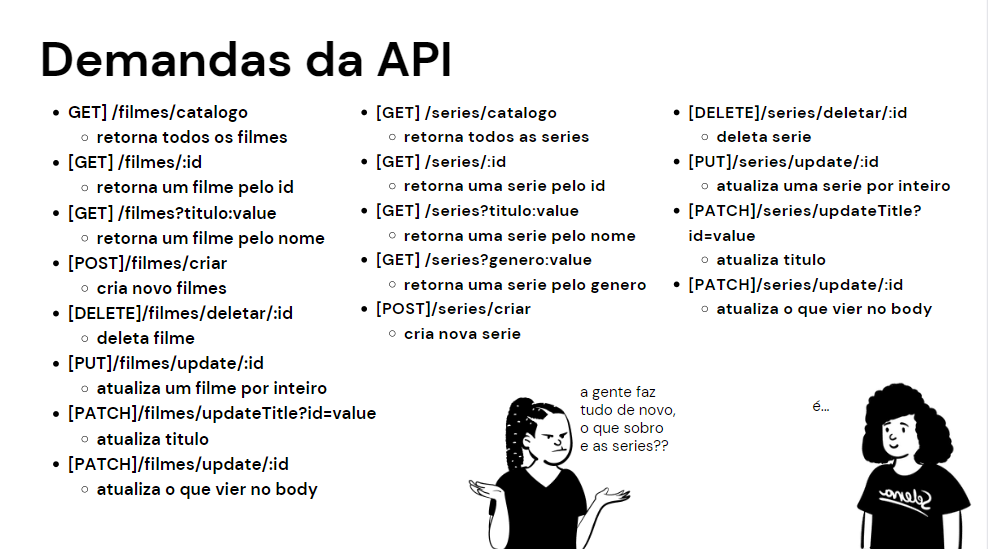

# Exercício de Casa 🏠 

<h1 align="center">
  
</h1>

- Usando a arquitetura MVC construa a API  que foi pedida pela galera de negocio.
- Documente sua API de forma adequada

### Pedidos de negócio
- [x] Quero uma rota que venha todos os filmes e series
duas rotas a /filmes e a /series
- [x] /filmes deve retornar todos os filmes
- [x] /series deve retornar todos as series
- [x] Devo conseguir filtrar por titulo, id e genero
- [x] Devo conseguir cadastrar filmes e series
- [x] Devo conseguir editar o nome de qualquer um deles
- [x] Devo conseguir substituir tudo de um filme ou serie
- [x] Devo conseguir editar qualquer campo deles
- [x] Quero casos de erro
---

Terminou o exercício? Dá uma olhada nessa checklist e confere se tá tudo certinho, combinado?!

- [ ] Fiz o fork do repositório.
- [ ] Clonei o fork na minha máquina (`git clone url-do-meu-fork`).
- [ ] Resolvi o exercício.
- [ ] Adicionei as mudanças. (`git add .` para adicionar todos os arquivos, ou `git add nome_do_arquivo` para adicionar um arquivo específico)
- [ ] Commitei a cada mudança significativa ou na finalização do exercício (`git commit -m "Mensagem do commit"`)
- [ ] Pushei os commits na minha branch (`git push origin nome-da-branch`)
- [ ] Criei um Pull Request seguindo as orientaçoes que estao nesse [documento](https://github.com/mflilian/repo-example/blob/main/exercicios/para-casa/instrucoes-pull-request.md).
